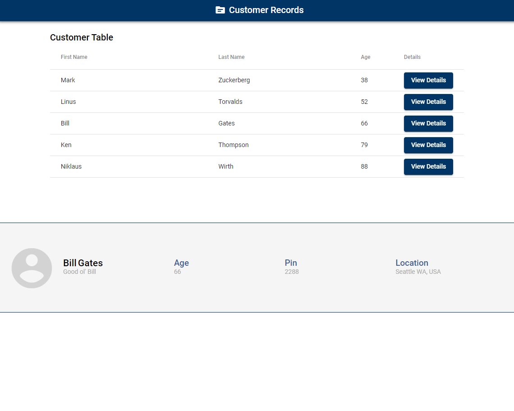

# Welcome to our customer records app.

## The goal of this app is to display a list of customer records in a table. The table should contain a button that will show further details about the customer record.

### This app consists of 3 components and 1 page.

- [Home Page](./src/app/pages/home/home.component.ts) should have 3 components.
    - [Header Component](./src/app/components/header/header.component.ts) is just the header for the page. It is already completed.
    - [Table Component](./src/app/components/table/table.component.ts) 
        - Create a table that displays all [Customer Records](./src/app/constants/customer-records.ts)
        - The Table should contain 4 columns: FirstName, LastName, Age, and a Details Button.
        - Sort the table records by Customer Age.
        - Selecting the Details Button should show the Table Details Component with the updated record.
        - Style the table in any way you'd like. Feel free to use [Angular Material Tables](https://material.angular.io/components/table/overview) or not, it's up to you.
    - [Table Detail Component](./src/app/components/table-details/table-details.component.ts) 
        - Display extra information of the selected Customer Record. 
        - Included fields (FirstName, LasName, Nickname, Age, PinCode, City, State, Country)
        - Style this component similar to the completed example below.

# Finished Example

